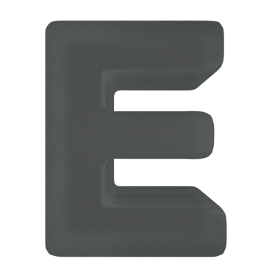

# VStack

Gstack offers great extensions for Geology Developer.

These extensions are language free, fit for everyone curated even you are not developer

# Curated List

- [**Extension**]() - Extension Description 

# Other Stacks
- [**VStack**](https://marketplace.visualstudio.com/items?itemName=seonglae.vstack) -  VSCode Default Extension Pack

- [**GStack**](https://marketplace.visualstudio.com/items?itemName=seonglae.gstack) - Geology VSCode Extension Pack

- [**CStack**](https://marketplace.visualstudio.com/items?itemName=seonglae.cstack) - Cloud Native VSCode Extension Pack

- [**FStack**](https://marketplace.visualstudio.com/items?itemName=seonglae.fstack) - Frontend Developer VSCode Extension Pack

- [**EStack**](https://marketplace.visualstudio.com/items?itemName=seonglae.estack) - File Explorer VSCode Extension Pack

- [**TStack**](https://marketplace.visualstudio.com/items?itemName=seonglae.tstack) - Simple Pretty Theme VSCode Extension Pack

- [**PPack**](https://marketplace.visualstudio.com/items?itemName=seonglae.pstack) - Productivity VSCode Extension Pack for Nerds

# Developer
Try type `seonglae` in extension search Menu
- [**Gtihub**](https://github.com/seonglae)
- [**Page**](https://www.seongland.com)

