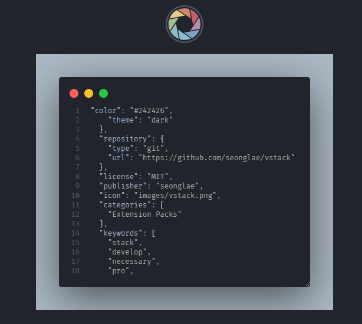
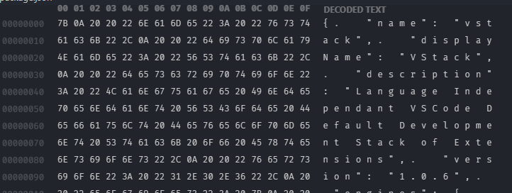

# VStack

VStack offers great extensions for both noob developers and mature developers.

These extensions are language free, fit for everyone curated even you are not developer

# Curated List

- [**VSCode Remote Development**](https://marketplace.visualstudio.com/items?itemName=ms-vscode-remote.vscode-remote-extensionpack) - VSCode Remote Development is powerful tool to develop in every environment everywhere
- [**Insert Unicode**](https://marketplace.visualstudio.com/items?itemName=brunnerh.insert-unicode) - Insert Unicode easily
- [**Fix checksums**]() - Fix Broken VSCode install
- [**Codesnap**]() - Beautiful Snapshot of your Code 

- [**Debug Visualizer**]() - 
- [**Hex Editor**]() - Hexa Editor
  
- [**Tabnine**]() - AI Based Code Intellisense auto complete
- [**Select Line Status Bar**](https://marketplace.visualstudio.com/items?itemName=tomoki1207.selectline-statusbar) - Shows count of selected line info

- [**Git Lens**]() - Git Text Editor Integration
- [**Git Graph**]() - Git Graph Visualizer
- [**Github Pull request**]() - Github pull request in VSCode

# Other Stacks
- [VStack](https://marketplace.visualstudio.com/items?itemName=seonglae.vstack) -  VSCode Default Extension Pack

- [GStack](https://marketplace.visualstudio.com/items?itemName=seonglae.gstack) - Geology VSCode Extension Pack

- [CStack](https://marketplace.visualstudio.com/items?itemName=seonglae.cstack) - Cloud Native Extension Pack

- [FStack](https://marketplace.visualstudio.com/items?itemName=seonglae.fstack) - Frontend Developer Extension Pack

- [EStack](https://marketplace.visualstudio.com/items?itemName=seonglae.estack) - File Explorer Extension Pack

- [TStack](https://marketplace.visualstudio.com/items?itemName=seonglae.tstack) - Simple Pretty Theme Extension Pack

- [PPack](https://marketplace.visualstudio.com/items?itemName=seonglae.pstack) - Productivity VSCode Extension Pack for Nerds

# Developer
- [Gtihub](https://github.com/seonglae)
- [Page](https://www.seongland.com)

